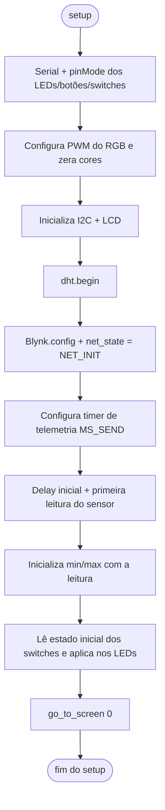
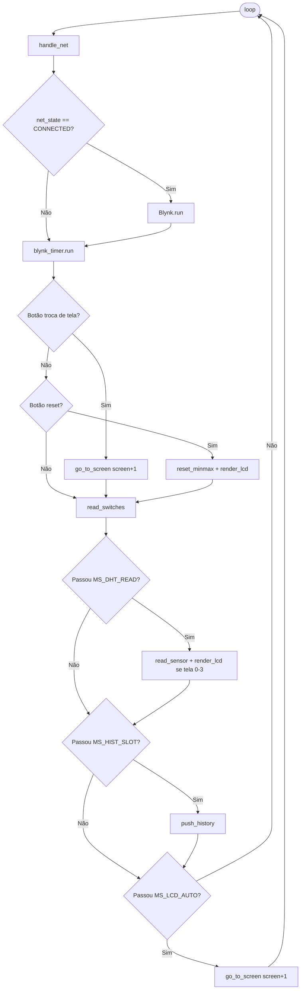
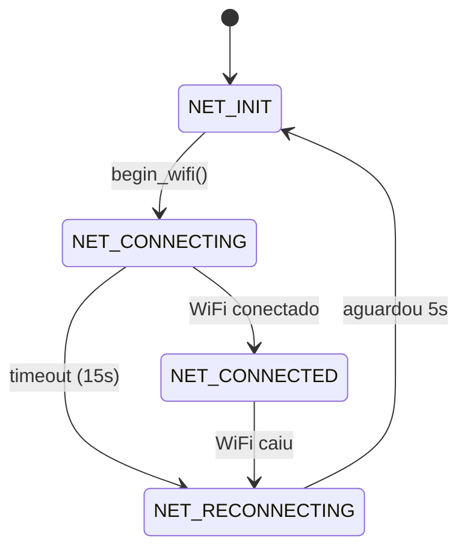
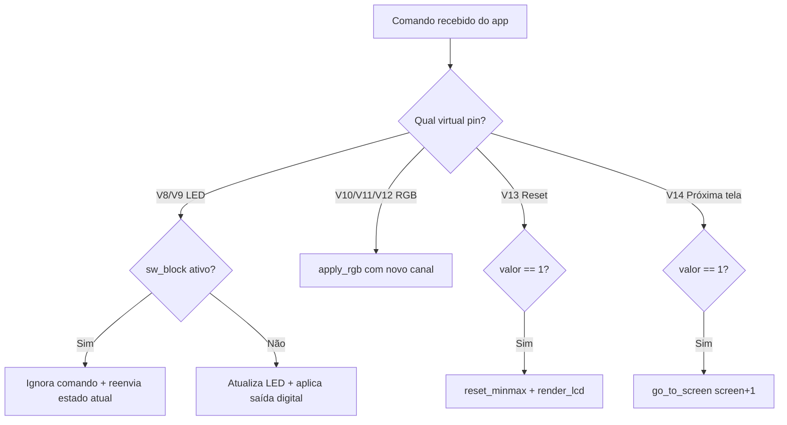
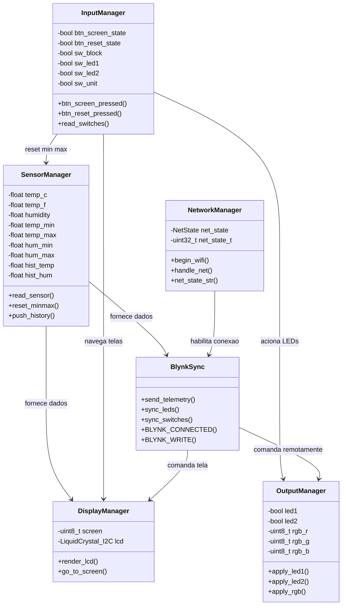
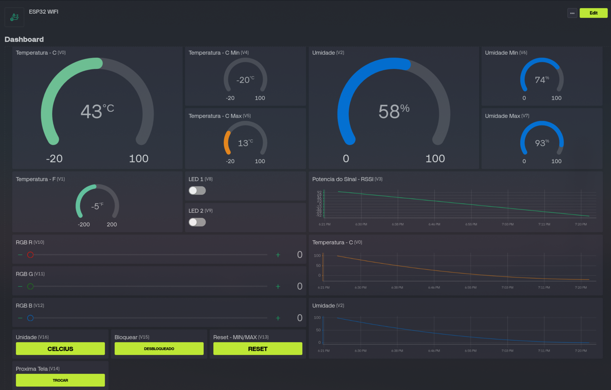

# Documentação — Monitoramento de Temperatura usando Wi-Fi e ESP32

**Disciplina:** GEX1087 – Tópicos Especiais em Computação XXVII (Prof. Luciano L. Caimi)
**Opção escolhida:** A — Plataforma Blynk

## 1. Visão Geral

O sistema usa um ESP32 em modo estação Wi-Fi (STA) para monitorar temperatura e umidade (DHT22), exibir os dados em um display LCD 16x2 local e permitir controle/monitoramento remoto via plataforma Blynk. O firmware opera de forma autônoma — display, botões e atuadores funcionam mesmo sem conexão com a nuvem — e a comunicação Wi-Fi é usada apenas para telemetria, histórico e controle remoto, conforme exigido na especificação.

## 2. Arquitetura de Hardware

Reaproveita a mesma protoboard e pinagem da atividade anterior (BLE), trocando apenas a camada de comunicação.

| Componente | Pino | Observação |
|---|---|---|
| LED 1 (simples) | GPIO 2 | Saída digital |
| LED 2 (simples) | GPIO 15 | Saída digital |
| LED RGB — Canal R | GPIO 17 | PWM (5kHz, 8 bits) |
| LED RGB — Canal G | GPIO 16 | PWM (5kHz, 8 bits) |
| LED RGB — Canal B | GPIO 4 | PWM (5kHz, 8 bits) |
| Sensor DHT22 | GPIO 18 | Com resistor de pull-up |
| Push-Button 1 (troca de tela) | GPIO 26 | Pull-down |
| Push-Button 2 (reset min/máx) | GPIO 27 | Pull-down |
| Switch 1 (bloqueio remoto) | GPIO 34 | Pull-down |
| Switch 2 (LED 1) | GPIO 32 | Pull-down |
| Switch 3 (LED 2) | GPIO 35 | Pull-down |
| Switch 4 (unidade °C/°F) | GPIO 33 | Pull-down |
| Display LCD 16x2 | I2C, endereço 0x27 | — |

O LED RGB suporta ânodo ou cátodo comum, configurado pela constante `RGB_COMMON_ANODE`.

## 3. Funcionalidades Locais do Firmware

### 3.1 Telas do Display LCD

| Tela | Conteúdo | Requisito atendido |
|---|---|---|
| 1 | Temperatura atual (°C) + Umidade | Seção 3.1 |
| 2 | Temperatura atual (°F) + Umidade | Seção 3.1 |
| 3 | Temperatura mínima / máxima desde a inicialização | Seção 3.1 |
| 4 | Umidade mínima / máxima desde a inicialização | Seção 3.1 |
| 5 | Status da conexão Wi-Fi/Blynk + RSSI | Seção 3.1 |

Alternância automática a cada 3 segundos (`MS_LCD_AUTO`) ou manual via Push-Button 1.

### 3.2 Botões Físicos

| Controle | Função | Pino |
|---|---|---|
| Push-Button 1 | Alterna manualmente a tela do LCD | GPIO 26 |
| Push-Button 2 | Reseta os valores mínimo/máximo | GPIO 27 |
| Switch 1 | Bloqueia/libera o controle dos LEDs pela plataforma remota | GPIO 34 |
| Switch 2 | Liga/desliga o LED 1 localmente (reflete no Blynk) | GPIO 32 |
| Switch 3 | Liga/desliga o LED 2 localmente (reflete no Blynk) | GPIO 35 |
| Switch 4 | Define a unidade (°C/°F) exibida no painel remoto | GPIO 33 |

Botões usam debounce por tempo (40ms) para filtrar ruído mecânico.

### 3.3 Atuadores

- **LEDs simples:** respondem a comandos da plataforma Blynk (V8, V9) ou dos switches físicos 2 e 3, o que ocorrer primeiro/mais recente.
- **LED RGB:** PWM em 3 canais, com valores de R, G e B recebidos individualmente da plataforma (V10, V11, V12).

## 4. Camada Wi-Fi

### 4.1 Conexão e Robustez

A rede utilizada é WPA2-Enterprise (eduroam), autenticando via `esp_eap_client` com identidade, usuário e senha (em vez de senha única de rede). As credenciais ficam isoladas em `secret.h`, fora do controle de versão — atendendo à exigência de não publicar credenciais em repositório.

A conexão é gerenciada por uma máquina de estados não bloqueante (`handle_net()`), exatamente no formato sugerido pela especificação:

**INICIALIZANDO (`NET_INIT`) → CONECTANDO (`NET_CONNECTING`) → CONECTADO (`NET_CONNECTED`) → RECONECTANDO (`NET_RECONNECTING`)**

- Timeout de conexão: 15 segundos (`MS_WIFI_TIMEOUT`)
- Intervalo antes de nova tentativa: 5 segundos (`MS_WIFI_RETRY`)
- O restante do firmware (sensores, display, botões) continua funcionando independentemente do estado da rede.

### 4.2 Frequência de Telemetria

Conforme a Seção 4.2 da especificação, temperatura, umidade e RSSI são enviados no máximo a cada 5 segundos (constante `MS_SEND`), respeitando também os limites de frequência de atualização do plano gratuito do Blynk.

O histórico de médias é mantido em um buffer circular de 60 posições, com uma amostra por minuto (`MS_HIST_SLOT` = 60000ms) — atendendo ao requisito de manter os últimos 60 minutos internamente.

## 5. Estrutura de Dados — Datastreams Blynk

| Virtual Pin | Nome / Uso | Tipo (spec) | Tipo (implementado) | Direção |
|---|---|---|---|---|
| V0 | Temperatura (°C) | Double | float | ESP32 → Blynk |
| V1 | Temperatura (°F) | Double | float | ESP32 → Blynk |
| V2 | Umidade (%) | Double | float | ESP32 → Blynk |
| V3 | RSSI (dBm) | Integer | int | ESP32 → Blynk |
| V4 | Temperatura mínima | — (auxiliar) | float | ESP32 → Blynk |
| V5 | Temperatura máxima | — (auxiliar) | float | ESP32 → Blynk |
| V6 | Umidade mínima | — (auxiliar) | float | ESP32 → Blynk |
| V7 | Umidade máxima | — (auxiliar) | float | ESP32 → Blynk |
| V8 | Estado LED 1 | Switch | int (0/1) | Bidirecional |
| V9 | Estado LED 2 | Switch | int (0/1) | Bidirecional |
| V10 | RGB — Canal R | Color Picker (zRGB) | int (0–255) | Blynk → ESP32 |
| V11 | RGB — Canal G | Color Picker (zRGB) | int (0–255) | Blynk → ESP32 |
| V12 | RGB — Canal B | Color Picker (zRGB) | int (0–255) | Blynk → ESP32 |
| V13 | Reset mínimos/máximos | Button | int (pulso 1) | Blynk → ESP32 |
| V14 | Avançar tela do LCD | — (extra) | int (pulso 1) | Bidirecional |
| V15 | Estado Switch 1 (bloqueio local/remoto) | Switch (somente leitura) | int (0/1) | ESP32 → Blynk |
| V16 | Estado Switch 4 (unidade °C/°F) | — (auxiliar) | int (0/1) | ESP32 → Blynk |

## 6. Segurança e Autenticação

- O Auth Token do dispositivo Blynk deve ser tratado como segredo — no firmware, ele é passado via `Blynk.config(BLYNK_AUTH_TOKEN)`, com a constante definida em `secret.h` (não versionado).
- As credenciais de rede eduroam (identidade e senha EAP) seguem a mesma prática, isoladas em `secret.h`.
- Recomenda-se usar um projeto/usuário Blynk específico da disciplina, distinto de contas pessoais.

## 7. Fluxogramas do Firmware

### 7.1 Setup



### 7.2 Loop Principal



### 7.3 Máquina de Estados de Rede



### 7.4 Callbacks do Blynk (Comandos Remotos)



## 8. Diagrama de Classes (Arquitetura Conceitual)

O firmware é escrito em C procedural (sem classes reais). O diagrama abaixo representa a organização lógica das funções e variáveis globais em módulos conceituais:



## 9. Instruções de Configuração e Execução

1. Criar conta em [blynk.io](https://blynk.io) e um novo **Template** de dispositivo.
2. No template, criar os **datastreams** listados na Seção 5 (mínimo: V0–V13, V15). V14 é um extra deste firmware (não exigido pela especificação); V16 atende ao requisito do Switch 4 descrito na Seção 3.2 da especificação.
3. Criar um **Device** a partir do template — o Blynk gera automaticamente o **Auth Token**.
4. Criar um arquivo `secret.h` (não versionado, adicionado ao `.gitignore`) com:
```cpp
   #define BLYNK_AUTH_TOKEN "seu_token_aqui"
   #define SECRET_EAP_IDENTITY "sua_identidade_eduroam"
   #define SECRET_EAP_PASSWORD "sua_senha_eduroam"
```
5. Montar o dashboard (Web ou app mobile Blynk) com: gauges/labels de temperatura e umidade, gráficos históricos (Superchart) de temperatura/umidade e RSSI, botões para os LEDs, color picker (ou 3 campos numéricos) para o RGB, e indicador de conectividade.
6. Widget **Button** (modo Push) ligado ao V14 já configurado no app, permitindo a troca de tela remota.
7. Compilar e enviar o firmware via Arduino IDE/PlatformIO, com as bibliotecas: `WiFi.h`, `Wire.h`, `LiquidCrystal_I2C`, `DHT`, `BlynkSimpleEsp32`, `esp_eap_client`.
8. Verificar no Serial Monitor (115200 baud) o status da conexão Wi-Fi/Blynk antes de considerar o dispositivo pronto.

## 10. Limitações e Observações

- **RGB implementado como 3 datastreams inteiros**, em vez de um único Color Picker (zRGB) como sugerido na especificação (ver Seção 5). Funcionalmente equivalente, cada canal é controlado de forma independente.
- **Histórico em RAM:** o buffer de histórico (`hist_temp`/`hist_hum`) não é persistido — reinicializações do ESP32 apagam o histórico acumulado.
- **Plano gratuito Blynk:** possui limites de datastreams, frequência de atualização e retenção de histórico; a frequência de telemetria foi dimensionada em conformidade com esses limites.

## 11. Visão Geral do Dashboard Blynk



O dashboard web foi montado com os seguintes widgets, todos ligados aos virtual pins descritos na Seção 5:

| Widget | Tipo | Virtual Pin |
|---|---|---|
| Temperatura - C | Gauge | V0 |
| Temperatura - C Min | Gauge | V4 |
| Temperatura - C Max | Gauge | V5 |
| Umidade | Gauge | V2 |
| Umidade Min | Gauge | V6 |
| Umidade Max | Gauge | V7 |
| Temperatura - F | Gauge | V1 |
| LED 1 | Switch | V8 |
| LED 2 | Switch | V9 |
| Potência do Sinal - RSSI | Gráfico histórico (linha) | V3 |
| RGB R | Slider (0–255) | V10 |
| RGB G | Slider (0–255) | V11 |
| RGB B | Slider (0–255) | V12 |
| Temperatura - C | Gráfico histórico (linha) | V0 |
| Umidade | Gráfico histórico (linha) | V2 |
| Unidade | Button (toggle texto) | V16 |
| Bloquear | Button (toggle texto) | V15 |
| Reset - MIN/MAX | Button | V13 |
| Próxima Tela | Button | V14 |

Os gauges de temperatura/umidade mostram o valor atual, enquanto os widgets "Min"/"Max" refletem os extremos calculados pelo firmware desde a última inicialização ou reset. Os gráficos históricos (RSSI, Temperatura e Umidade) usam o Superchart do Blynk para exibir a evolução ao longo do tempo. Os botões de "Unidade" e "Bloquear" exibem o estado atual (somente leitura, refletindo os switches físicos), enquanto "Reset - MIN/MAX" e "Próxima Tela" enviam um pulso (valor 1) que aciona os respectivos `BLYNK_WRITE`.